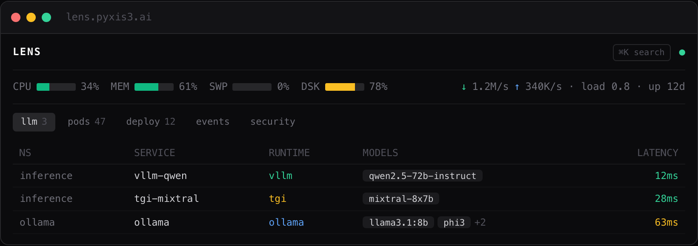

<div align="center">

# lens

**Lightweight in-cluster observability for LLM &amp; AI/ML serving on Kubernetes.**

LLM endpoint discovery · pod &amp; workload browser · in-browser `kubectl exec` · per-namespace resource pressure · security panel

[](https://lens.pyxis3.ai/?utm_source=github&utm_medium=readme&utm_campaign=lens)
[](https://app.lens.pyxis3.ai/?utm_source=github&utm_medium=readme&utm_campaign=lens)
[](LICENSE)
[](https://bun.sh)
[](https://vuejs.org)
[](https://kubernetes.io)
[](https://www.typescriptlang.org)

<sub>

[**What it does**](#what-it-does) · [**Why**](#why-this-exists) · [**Architecture**](#architecture) · [**Run locally**](#run-locally) · [**In cluster**](#run-in-cluster) · [**Where it fits**](#where-it-fits)

</sub>

</div>

<p align="center"></p>

---

Read-only views over your serving cluster's resources, GPU pressure visibility, and an in-browser `kubectl exec` terminal - all served from a single Bun process running inside the cluster. Built for the operational pattern of running open-source LLM inference on Kubernetes (vLLM, TGI, llama.cpp, Ollama): inspect inference pods, tail accelerator-bound workloads, and exec into a model server without leaving the browser.

**Demo - [app.lens.pyxis3.ai](https://app.lens.pyxis3.ai/?utm_source=github&utm_medium=readme&utm_campaign=lens)** · login required (the live cluster gates every app behind [shortlink](https://shortlink.pyxis3.ai/?utm_source=github&utm_medium=readme&utm_campaign=lens) forward-auth - one-factor, staff/admins; exec gives shell access to the live cluster). **Site - [lens.pyxis3.ai](https://lens.pyxis3.ai/?utm_source=github&utm_medium=readme&utm_campaign=lens)**.

## What it does

- **LLM / inference endpoint discovery** - scans every cluster `Service` on its declared TCP ports for an OpenAI-compatible `/v1/models` response. Auto-detects vLLM, TGI, llama.cpp, Ollama, sglang, Triton - reports model list, probe latency, and inferred runtime, refreshed every 30s. No outbound traffic, no tokens spent. *This is the headline view for an LLM-serving cluster.*
- **Pod & workload browser** - namespaces, pods, deployments, services, configmaps, events. Built to surface the inference layer (vLLM/TGI/llama.cpp pods, KEDA scalers, ResourceQuotas per tenant).
- **Workload actions** - restart or scale a Deployment, or delete a stuck Pod, from the browser. **Gated behind RBAC**: the default ClusterRole is read-only, so these are no-ops until you grant write access.
- **In-browser `kubectl exec`** - open a real shell on any pod via `xterm.js` over WebSocket. Critical for AI/ML serving where you need to inspect model weights, tokenizer state, or attach to a running vLLM process.
- **Resource pressure & alerts** - node CPU / memory / load / disk read straight from the host `/proc`, plus per-namespace allocation against requests/limits and `ResourceQuotas` - **no metrics-server required** (so no per-pod live usage or GPU utilization; GPU is shown by request/allocation). Configurable per-namespace thresholds raise alerts you can acknowledge or dismiss, streamed live over WebSocket.
- **Security panel** - failed-auth events from collected log streams; helps when fronting LLM endpoints with `auth_request`.
- Vue 3 + Vite frontend; Bun TypeScript backend.

## Why this exists

The big Kubernetes dashboards (Lens Desktop, Headlamp, Octant) are general-purpose and heavy. AI/ML serving has different debugging needs:

- Inference pods are large (multi-GB model weights), slow to start, and you need to know *exactly* which one is in `ContainerCreating` versus actually serving traffic.
- `kubectl exec` is the fastest way to confirm a vLLM/TGI process is healthy without exporting `/metrics` for every diagnostic.
- Multi-tenant LLM serving uses `ResourceQuotas` and `KEDA` heavily - you want pressure visible per namespace, not just per node.

lens is single-binary scope: enough to debug an LLM-serving cluster from inside it, without a 200 MB Electron download or a separate auth proxy.

## Architecture

```
┌─────────────┐   HTTPS/WS    ┌──────────────────────┐   K8s API   ┌────────────┐
│ Vue 3 SPA   │ ────────────> │ Bun server (TS)      │ ──────────> │ K8s control │
│ xterm.js    │ <──────────── │ • REST proxy         │ <────────── │   plane     │
└─────────────┘               │ • exec WS bridge     │             └────────────┘
                              │ • SA-token rotation  │
                              └──────────────────────┘
```

The server reads its bearer token from the standard service-account mount at `/var/run/secrets/kubernetes.io/serviceaccount/token` and proxies authenticated calls to the API server. No external secrets store needed.

### LLM-endpoint discovery (`/api/llm`)

The server enumerates every cluster `Service`, ranks the candidates by container-image heuristics (vllm / tgi / llama-server / ollama / sglang first), probes `http://<svc>.<ns>.svc.cluster.local:<port>/v1/models` with a 1.5 s timeout in batches of 16, and reports back the parsed model list plus the time-to-first-byte. Runtime is identified from `data[0].owned_by` (authoritative), then the `Server` header, then the image name. Results are cached for 30 s; `↻ rescan` bypasses cache.

## Run locally

Requires [Bun](https://bun.sh/) and access to a Kubernetes cluster (or a `kind` / `k3d` / `k0s` local cluster).

```sh
bun install
bun run dev       # frontend
bun run server    # backend
```

## Run in cluster

```sh
docker build -t lens:dev .
# Deploy as a Deployment + ServiceAccount with the RBAC permissions you want
# the dashboard to have - by default, read-only ClusterRole bound to the SA.
```

## Where it fits

Open-source AI-/LLM-infrastructure tooling published by [PYXIS3](https://pyxis3.ai/?utm_source=github&utm_medium=readme&utm_campaign=lens). lens is an observability layer for an LLM-serving Kubernetes cluster running vLLM / TGI / llama.cpp / Ollama side by side.

## Status

Single-developer project, used in production on the PYXIS3 homelab cluster. Read-only by default; `exec` and all write actions (scale / restart / delete) are gated behind RBAC.
